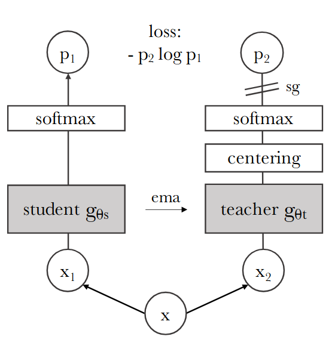
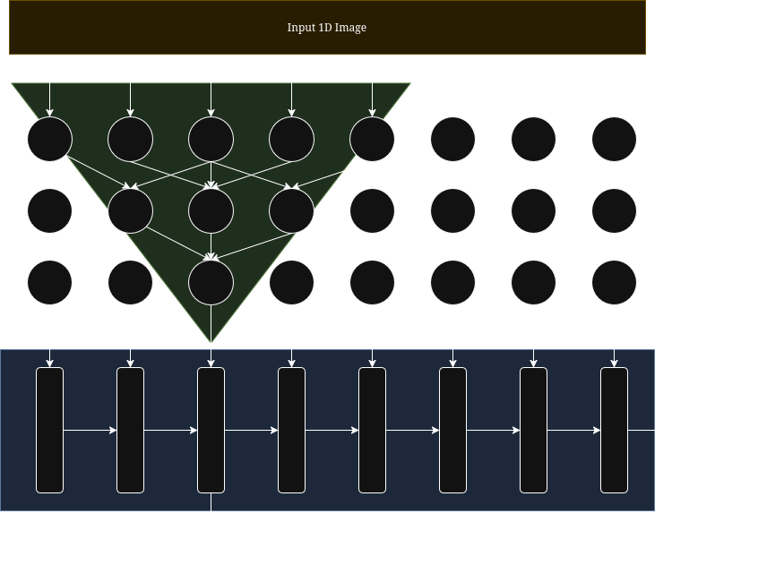
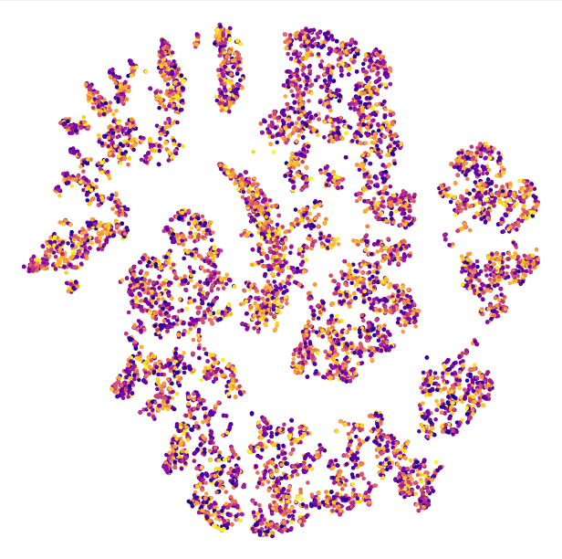

# FastDINO

# TLDR
This is a fun experimental method which produces a self-supervised model that trains far faster than conventional methods.

# Self-Supervised Embeddings Overview

For a supervised model to be successful, it must learn rich representations of the input to generate high-quality embeddings. These embeddings can then be used in tasks such as zero-shot classification or even object detection in the case of DINO.

## Autoencoder / "bottleneck" approach
This is a more conventional method of creating embeddings from the input data. It works by "compressing" and then "decompressing" the input. The reasoning goes that this forces the model to learn important features that are commonly represented, and to reconstruct the original image from the latent space efficiency.

The main drawback to this approach is that the embeddings it produces are normally quite large, and even if the sole purpose is to create the embeddings, you must train BOTH the encoder and the decoder.

Nonetheless, this method is widely used in image diffusion (both the encoder and decoder) as it serves to stabilize training by introducing pre-learned features. Other tasks such as zero-shot classification or object detection are infeasible due to the large latent variable, in combination with the high compute costs of the encoder.

## DINO
This SOTA technique learns rich representations by comparing the output embeddings from a local crops against a global crop. If the embeddings match, then the model has successfully learned to 'predict' the outer context of a local crop. However, this method, like an autoencoder, also requires two models: a student model for local crops, and a teacher model for global. It's also quite difficult to balance these two models while they are training as the embeddings must be distinct from each other while also not collapsing to zero; thus involving a lot of hyperparameters which must be fine-tuned for each dataset and each training environment. However, the biggest drawback is that you must create at least four model inferences: student local, student global, teacher local, teacher global, to perform a single stable iteration of DINO.

## FastDINO

Unlike an autoencoder or DINO, this method only requires a single inference (and backpropagation) to iterate the model weights. Rather than relying on manually creating the local/global crops, we instead leverage fundamental properties of CNNs to generate local/global embeddings. We notice that each kernel output only views a limited context of it's size. By placing multiple convolutional layers on top of one another, we can expand its scope to create 'pseudo-local-crops'. As such, we can compare the output of each final kernel to the 'averaged global scope' without requiring a student/teacher pair like with DINO. Because of this, we drastically reduce the compute requirements while also maximizing the context given as we essentially produce a local crop per output node.

# Proof of Concept

> [!NOTE] 
> I used music rather than vision because it's much easier to train on, yet it is still practical for everyday use.

As a *very* rough prototype, I trained my method on my own personal collection of songs (15k / 750 hours). Within only 30 minutes of training, I was able to generate useable embeddings to create clusters for my dataset while being completely unsupervised!.

As you can see, the T-SNE reduction clearly identifies prominent clusters. When I was manually exploring this data, each cluster was surprising well-defined with a specific genre or artist.

# Final Notes

I mainly hope to show a proof of concept before moving into the vision domain to directly compete with DINO. 